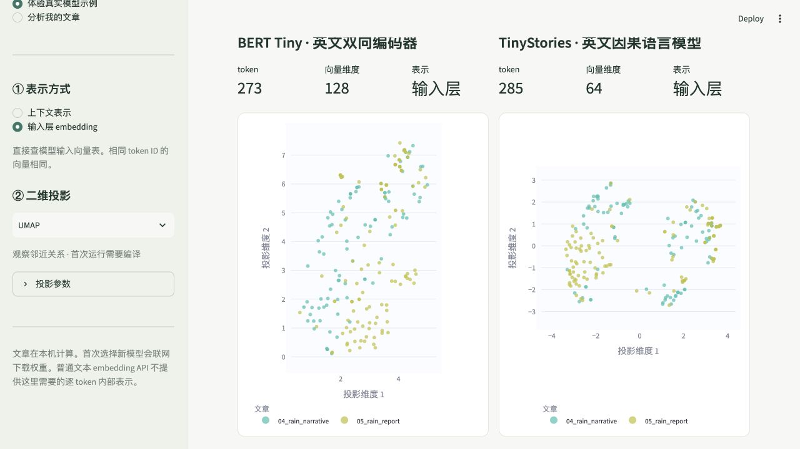

# Wording Style Visualizer · 文迹

把文章放进不同语言模型，查看每个 token 在模型向量空间里的二维投影。支持输入层 embedding 和上下文表示两种模式，每篇文章一种颜色，可以全看、单看或选择几篇对照。

[下载完整项目 ZIP](https://github.com/ChaoZhang173/Wording-Style-Visualizer/archive/HEAD.zip) · [GitHub 仓库](https://github.com/ChaoZhang173/Wording-Style-Visualizer) · [English](README.en.md) · [MIT 许可证](LICENSE) · [CSV 导入示例](examples/articles.csv)



## 第一次使用

1. 安装 **Python 3.12**（也支持 3.10、3.11）。从 [Python 官网](https://www.python.org/downloads/) 下载；Windows 安装时勾选 **Add python.exe to PATH**。
2. [下载完整项目 ZIP](https://github.com/ChaoZhang173/Wording-Style-Visualizer/archive/HEAD.zip)，解压整个项目文件夹。
3. macOS 双击 `start.command`；Windows 双击 `start.bat`；Linux 在项目文件夹运行 `bash start.sh`。
4. 等待首次安装完成，浏览器会打开本地工具。若未自动打开，访问 <http://localhost:8501>。
5. 先打开内置示例熟悉交互，再导入自己的文章、选择模型和表示模式、生成地图。

启动器会在项目内创建 `.venv`，并安装界面、算法和模型运行组件。**首次安装需要联网，模型运行组件较大，可能需要几分钟。** 首次选择一个模型时，还需要下载它的权重；随后可复用本地缓存。普通使用无需编辑代码或提供商业 embedding API Key。

如果项目已有可用的 `.venv`，启动器会优先使用它，即使系统默认 Python 版本较旧也可以启动。

保留启动窗口。使用结束后在该窗口按 `Ctrl+C`；关闭浏览器页面不会自动关闭程序。

macOS 如果拒绝直接打开下载的启动文件，可以在终端进入项目文件夹运行 `bash start.sh`。若提示找不到 Python，请先完成第 1 步，并重新打开启动窗口。

Windows 的命令行示例都应在解压后的项目文件夹运行；PowerShell 需要保留命令前的 `.\`。路径里有空格时，使用 `cd "完整的项目文件夹路径"`。macOS 完整模型运行建议使用 Apple Silicon 原生 Python；Intel Mac 或通过 Rosetta 运行的 x86 Python，请使用下方 `--light` 演示方式。当前要求的 PyTorch 版本已不提供官方 Intel Mac 安装包（[官方说明](https://dev-discuss.pytorch.org/t/pytorch-macos-x86-builds-deprecation-starting-january-2024/1690)）。

### 只想先看看示例

内置演示使用两个小型英文预训练模型的**真实预计算 token 向量**：`prajjwal1/bert-tiny`（双向编码器）与 `roneneldan/TinyStories-1M`（因果语言模型），输入是项目原创的两篇英文示例。每份记录保留模型 ID、revision、层和窗口等计算信息。

这些小模型用于快速体验交互和验证两种表示的计算流程，不代表大型模型的文风判断能力。分析自己的文章时，仍可选择 Qwen 等主要模型预设。内置演示仅对应固定文章，不会用示例向量冒充对新文章的分析；分析新文章需要安装模型运行组件。这是本地运行的程序，仓库链接不是已部署的在线演示。

省去模型组件的轻量启动方式：

```bash
# macOS / Linux
bash start.sh --light

# Windows
.\start.bat --light
```

之后正常运行启动器，即会补齐模型组件。

## 如何导入文章

- 直接在界面粘贴文章。
- 一次拖入多个 `.txt`、`.md`、`.docx` 文件；文件名用作标题。
- 上传包含这些文件的 `.zip`，可以保留子文件夹。请先解开嵌套 ZIP。
- 用一个 `.csv` 放入很多篇文章：每行一篇，`text` 或 `正文` 列必填，`title` / `标题`、`author` / `作者` 可选。参考 [articles.csv](examples/articles.csv)。含逗号、换行的正文应放在双引号内；Excel 导出为 CSV UTF-8 即可。

推荐文本使用 UTF-8；同时支持带标记的 UTF-16 和常见中文 GB18030。DOCX 导入正文和表格中的文字，不保留排版。图片、扫描 PDF 和旧版 `.doc` 当前不支持。

单个文件最大 20 MB，一次导入总量最大 100 MB、最多 1,000 篇；ZIP 解压后的内容最多 50 MB。文件能导入，并不表示可以一次把所有 token 放进内存。大量文章建议先调低每篇 token 上限，确认结果后再增加。

## 图上一个点是什么

一个点对应原文中**某一次 token 出现**。token 可能是一个汉字、词、词的一部分、标点或空白，不保证等同于自然语言里的“一个词”。悬停可以查看 token 和原文位置。同一篇文章共享颜色和图例。

### 输入 embedding

```text
文章 → 模型自己的 tokenizer → token ID → 输入向量表 → 二维投影
```

直接读取 `model.get_input_embeddings()`，不加入上下文。同一模型里相同 token ID 的向量相同，因此重复出现的 token 会重合。这种视图主要帮助观察用词构成。

### 上下文表示

```text
文章 → tokenizer → 模型前向计算 → 指定层逐 token 的 hidden states → 二维投影
```

同一个 token 在不同位置通常得到不同表示。可以选择不同层，探索它们如何变化。自回归模型通常看到当前位置之前的上下文；双向编码模型可以利用窗口两侧文本。具体层的含义取决于模型结构，最后一层并不自动等于“最能表示文风”的一层。

两种模式都需要能读取内部表示的模型。一般返回整段文本单个向量的商业 embedding 接口，无法替代这两种逐 token 计算。本版使用 Hugging Face Transformers 支持的开放权重模型，预设包括 Qwen 2.5 0.5B、Qwen 3 0.6B 和中文 BERT。一次最多选两个模型并排查看，也可以填入兼容的模型 ID / 本地路径替代预设。自定义模型需要标准 `AutoModel` 和 fast tokenizer，首版不支持需要执行远程自定义代码的模型或 encoder-decoder 架构。

上下文层编号 `-1` 表示最后层，`0` 表示模型返回的初始表示。初始表示可能已经包含位置信息等处理，因此层 `0` 与单独的“输入层 embedding”模式不一定相同。

## 如何比较

同一模型、同一层、同一次分析里的文章会**共同拟合一个二维空间**。隐藏文章仅改变显示，保留坐标与颜色；勾选图例或文章列表即可切换。重新生成分析、增加文章或更换参数，则可能改变布局。

上方文章列表决定显示和导出范围；单击图例可临时隐藏文章，双击图例可聚焦一篇，这种临时图例操作不改变导出范围。可以勾选按原文顺序连线，连线仅连接同一个计算窗口里的相邻 token，避免跨窗口造成误导。

不同模型会得到各自的投影。不同模型的 tokenizer、维数、坐标轴方向都可能不同，不能将两个面板的相同坐标视为相同含义，也不能把向量直接混在一个空间里。跨模型适合比较相同原文的整体现象，不适合逐点按坐标对齐。

### 可选降维算法

| 算法 | 用途与说明 |
|---|---|
| PCA | 线性投影，会中心化；适合作为可解释、稳定的基础对照。 |
| SVD | Truncated SVD，不进行中心化；与 PCA 对照可观察原点选择的影响。 |
| t-SNE | 侧重局部邻近关系；群组之间的距离和大小不要直接当作语义量度。 |
| UMAP | 从邻域关系构建布局，邻居数和最小距离会影响形状。首次运行可能稍慢。 |
| PaCMAP | 兼顾局部与较大尺度的关系；作为可选依赖安装。 |

算法彼此是可选项，不会依次把二维输出再送入下一个算法。t-SNE 对很高维数据可能先做 PCA 预压缩。界面可控制向量归一化和随机种子；比较实验时应保持这些设置一致。

为避免重复输入向量被非线性算法人为分开，t-SNE、UMAP、PaCMAP 会先对完全相同的向量去重，再把坐标还原给每次出现的 token。因此重复频次不作为它们拟合邻域的权重。PCA/SVD 保留原始行频次。不同向量太少时会退回 PCA，界面会提示。

安装 PaCMAP：

```bash
bash start.sh --pacmap       # macOS / Linux
.\start.bat --pacmap         # Windows
```

只在预计算演示里使用 PaCMAP 时，可以同时加上 `--light --pacmap`。PaCMAP 安装失败不影响其他算法，重新用普通启动方式或 `--light` 运行即可。

## 长文章、性能与结果含义

超过配置窗口长度的文章会分窗口处理，可设置重叠区，以缓解上下文在边界处断开。每个原文 token 最终只保留一次表示，使用最早包含它的窗口；位置从每个窗口重新开始，不会对多个窗口的向量取平均。它能看到的是对应完整窗口，而非整篇无限长度的文章。特殊 token 会参与上下文计算，但不作为原文中的点绘制。

默认每个窗口最多 256 个 token（含特殊 token），相邻窗口重叠 32 个。默认每篇最多保留 1,500 个点、整张图最多 6,000 个点。**达到上限时保留文章开头，不是全文随机抽样**；整张图的额度会在文章之间分配。界面最高允许每篇及全图各 20,000 个 token。窗口可能因模型自身限制调小；原始数量、实际保留数量及调整会记录在运行信息里。比较文章时应检查这些设置一致，避免把仅有开头的图当成全文分布。

输入 embedding 模式无需运行所有 Transformer 层，上下文模式的计算和内存开销更高。本工具仍需加载模型；建议先从小模型、少量文章和较短窗口开始。CPU 可以运行兼容的小模型；更大的模型往往需要更多内存或 GPU。设备选 `auto` 时会优先尝试 CUDA、Apple MPS，再使用 CPU。模型默认缓存在项目内 `.cache/huggingface`；如果已配置 `HF_HOME`，则沿用该目录。磁盘占用取决于所选模型。

二维地图是一种探索工具。它同时可能反映词汇、语义、句法、位置以及模型训练中的规律，**不是独立的“文风评分”、作者鉴定或风格相似性的证明**。固定随机种子有助于复现，但库版本、设备与数值精度也可能影响结果。

在“下载图像与数据”中选择 PNG 或 SVG，点击“准备图片”后保存；也可以直接下载离线可打开的交互 HTML。ZIP 数据包包含 `coordinates.csv`、`tokens.json`、`metadata.json` 和 `figure.html`，记录二维坐标、token 及模型/投影参数，不包含模型权重或高维向量。CSV 会处理以公式符号开头的文本，JSON 保留原始字符串。当前版本没有重新导入此数据包恢复计算的功能。

导出文件含有 token 文本，运行记录可能包含所有参与拟合文章的标题，即使只导出部分文章，分享前也可先检查内容。文章在运行本工具的电脑上处理；启动器默认只监听本机，模型下载会访问模型托管服务。

## 常见问题

**第一次卡在安装或下载。** 先确认网络可访问 Python 包源和模型托管站点，保留窗口查看进度。再次启动会复用已经完成的安装与下载。仅体验界面可用 `--light`。

**显示内存不足。** 换用更小的模型，缩短窗口，减少每篇 token 上限或文章数量，再重新分析。上下文窗口越长，开销通常越大。

**换了模型以后 token 数量不同。** 这是正常现象，不同模型使用不同 tokenizer。

**有些点重合、看不见。** 输入 embedding 里相同 token 本就相同；不会为了美观添加随机抖动来制造差异。

**启动端口被占用。** 关闭上次启动的程序，或运行 `bash start.sh --port 8502` / `.\start.bat --port 8502`。

**导出的图片中文变成方框。** macOS 通常已有苹方字体，Windows 通常已有微软雅黑。Linux 请安装 Noto Sans CJK 字体后重启工具；例如 Ubuntu/Debian 可运行 `sudo apt install fonts-noto-cjk`。工具不会自动下载字体。交互 HTML 则使用浏览器可用的字体。

**需要重新安装环境。** 停止程序，把项目内的 `.venv` 文件夹重命名后重新启动。文章原文件不会因此更改。

## 开发与开源

项目使用 MIT 许可证。`examples/` 中的文章为本项目创作，可随项目使用；外部模型、权重和相关组件各自的许可证仍然适用。此仓库已包含双语文档、启动器、示例及离线自动化测试配置。内部 Python 包名保留为 `token_atlas`。

熟悉 Git 的用户也可克隆仓库：

```bash
git clone https://github.com/ChaoZhang173/Wording-Style-Visualizer.git
cd Wording-Style-Visualizer
```

手动安装（macOS / Linux）：

```bash
python3.12 -m venv .venv
source .venv/bin/activate
python -m pip install -r requirements.txt -r requirements-models.txt
python -m streamlit run app.py --server.address=127.0.0.1 --browser.gatherUsageStats=false
```

手动安装（Windows PowerShell 或命令提示符，无需激活环境）：

```powershell
py -3.12 -m venv .venv
.\.venv\Scripts\python.exe -m pip install -r requirements.txt -r requirements-models.txt
.\.venv\Scripts\python.exe -m streamlit run app.py --server.address=127.0.0.1 --browser.gatherUsageStats=false
```

运行测试：

```bash
python -m pip install -r requirements-dev.txt
python -m pytest -q
python -m ruff check .
```

常规测试使用固定数据和模型替身，不下载大模型。真实模型端到端检查需要单独安装模型依赖并下载权重。依赖采用兼容版本范围，尚不是跨平台锁定环境；严谨复现实验应同时记录实际安装版本。

重新生成真实示例向量（需要模型依赖和网络下载；生成结果写入 `demo_data/`）：

```bash
# 默认：两个小型英文模型 + 原创英文文章
python scripts/build_demo.py --device cpu

# 较大模型版本：Qwen 2.5 0.5B + 中文 BERT + 原创中文文章
python scripts/build_demo.py --full
```

脚本会重新写入演示清单；`--full` 会切换为中文演示组合，下载与内存开销也更大。无需重新生成就可以浏览仓库内已有的演示。

技术参考：[Transformers 的逐 token 输出](https://huggingface.co/docs/transformers/main_classes/output)、[scikit-learn 分解方法](https://scikit-learn.org/stable/modules/decomposition.html)、[UMAP 的可复现性](https://umap-learn.readthedocs.io/en/latest/reproducibility.html)、[PaCMAP](https://github.com/YingfanWang/PaCMAP)。
